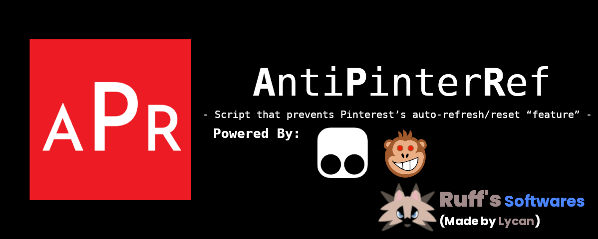
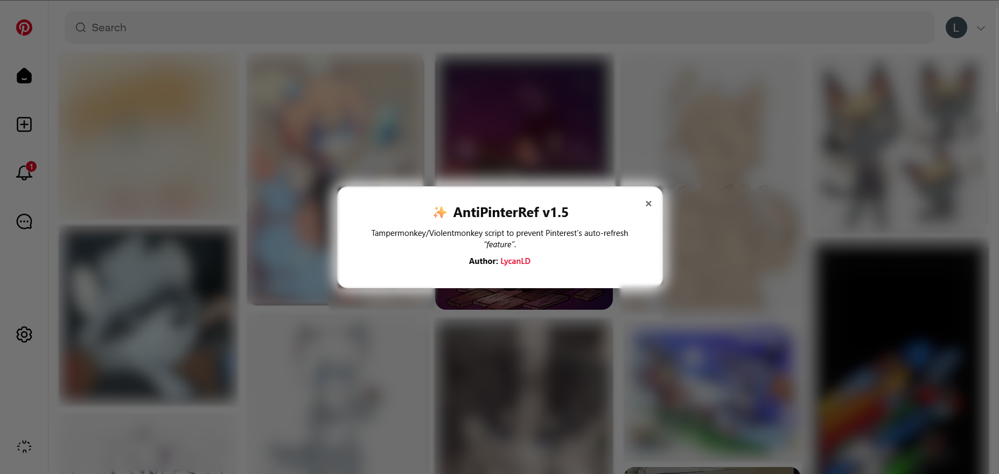

# ✨ AntiPinterRef

<p align="center">
  <a href="https://github.com/LycanLD/AntiPinterRef/raw/refs/heads/master/AntiPinterRef.user.js">
    
  </a>
</p>

**AntiPinterRef** is a Tampermonkey/Violentmonkey userscript that prevents Pinterest’s annoying auto-refresh/reset “feature” by simulating user activity and blocking forced reload triggers.

---

## 🚀 Features

- 🛑 Blocks Pinterest’s **auto-refresh banners** (no more “See new pins” popping up)  
- 🎭 Spoofs user activity (fake mouse moves, key presses, tiny scrolls)  
- 🔒 Prevents `location.reload()` hijacks and `onbeforeunload` nags  
- 🎨 Adds a sidebar **About button** with credits  
- ⚙️ Configurable via constants (interval, jitter, verbose logging)  

---

## 📥 Installation

1. Install a userscript manager:  
   - [Tampermonkey (Chrome/Edge/Firefox)](https://www.tampermonkey.net/)  
   - [Violentmonkey (Firefox/Chromium/Opera)](https://violentmonkey.github.io/)  
2. Click the **Install AntiPinterRef** button above ⬆️  
3. Confirm the installation in your userscript manager.  

---

## 📸 Screenshot



---

## ⚙️ Configuration

You can tweak script behavior by editing the `CONFIG` object inside the script:

```js
const CONFIG = {
  intervalMs: 20_000,   // how often to fake activity (ms)
  tinyScrollPx: 10,     // scroll amount per "nudge"
  jitter: true,         // add randomness to activity
  verbose: false        // enable console debug logs
};
````

---

## 🛠 Development

Clone the repo:

```bash
git clone https://github.com/lycanld/AntiPinterRef.git
cd AntiPinterRef
```

Edit `AntiPinterRef.user.js` and load it in Tampermonkey as a **local file script** for testing.
When ready, commit and push — the raw GitHub URL can be used for installs.

---

## 🤝 Contributing

Pull requests are welcome!
If you find new Pinterest tricks that bypass the script, open an issue or PR.

---

## 📜 License

MIT © [LycanLD](https://github.com/lycanld)